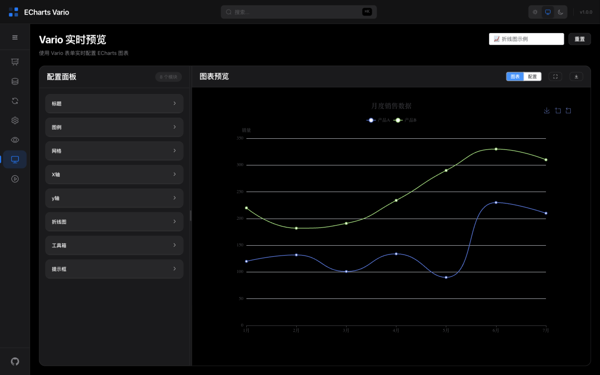
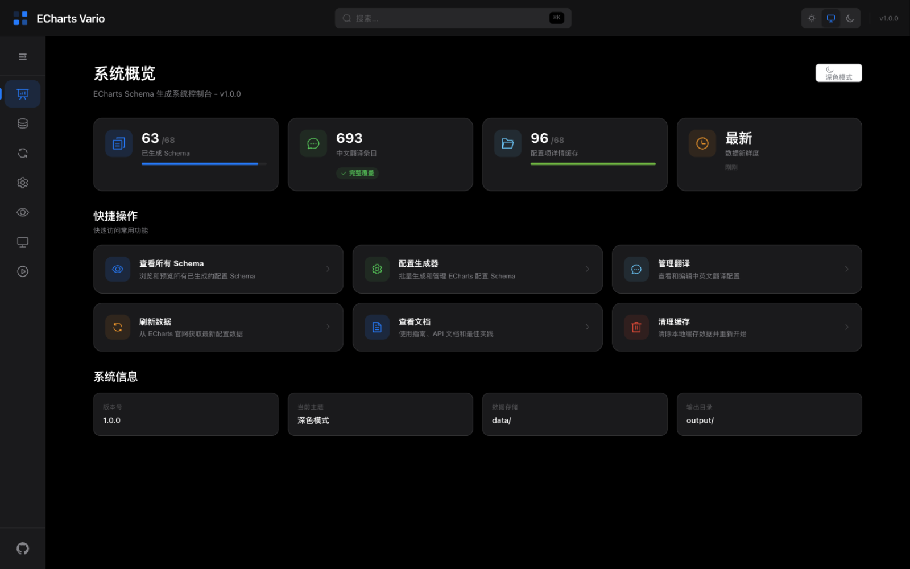
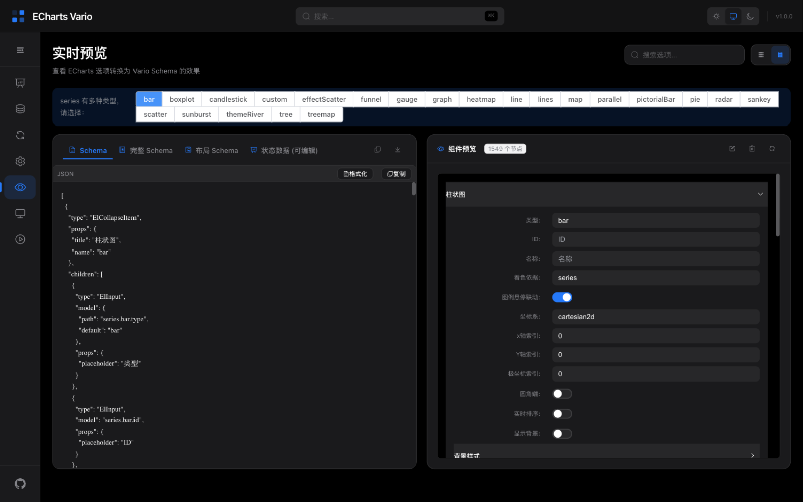

<div align="center">

# Vario ECharts

**Apache ECharts 的 Schema 驱动式可视化图表构建引擎。**

将 ECharts 整套配置体系自动转化为中英双语句式表单，实时预览、即调即见 —— 用表单代替记忆配置项。

*A schema-driven visual chart builder for Apache ECharts.*

[](./LICENSE)
[](https://vuejs.org/)
[](https://echarts.apache.org/)
[](https://vitejs.dev/)
[](https://pnpm.io/)

[在线体验](https://huyongle.github.io/vario-echarts/) · [文档](./docs/01-项目概览.md) · [快速开始](#-快速开始)

</div>

## 📸 预览

**Studio 可视化工作台** —— 用 Vario 表单实时配置 ECharts 图表，左侧配置面板、右侧即时渲染：



**更多界面**：

| 概览 Dashboard | Schema 详情预览 |
|:---:|:---:|
|  |  |

## ✨ 特性

- **🔧 智能 Schema 生成** —— 从 ECharts 官方文档自动拉取配置数据，生成可驱动的句式 Schema，覆盖 60+ 配置项
- **🎯 可视化配置工作台** —— Studio 实时预览：表单化配置、图表即时渲染、Schema 查看/编辑/导出
- **🧩 智能组件库** —— `SmartStyleSelect` / `SmartColorPicker` / `SmartLineStyleEditor` 等编辑器组件，样式配置开箱即用
- **🌍 中英双语** —— 选项数据与翻译自动同步，i18n 架构可扩展
- **⚡ CLI 工具链** —— 数据获取、Schema 批量转换一条命令完成

## 📦 Packages

基于 pnpm workspace 的 monorepo：

| 包 | 说明 |
| --- | --- |
| [`@vario-echarts/core`](./packages/core) | 核心 Schema 生成器 |
| [`@vario-echarts/fetcher`](./packages/fetcher) | ECharts 官方文档数据获取器 |
| [`@vario-echarts/cli`](./packages/cli) | 命令行工具（fetch / convert / generate） |
| [`@vario-echarts/smart-components`](./packages/smart-components) | 智能 Vue 表单组件库 |
| [`studio`](./apps/studio) | 可视化配置工作台（Vue 3 + Element Plus + Monaco） |

## 🚀 快速开始

### 环境要求

- Node.js ≥ 18
- pnpm ≥ 10

### 安装与启动

```bash
# 克隆仓库
git clone https://github.com/huyongle/vario-echarts.git
cd vario-echarts

# 安装依赖（postinstall 会自动构建 core / fetcher）
pnpm install

# 启动 Studio 开发服务器
pnpm dev
```

打开 http://localhost:3001 即可访问 Studio 工作台。

### 常用命令

```bash
pnpm dev              # 启动 Studio 开发服务器
pnpm build            # 构建所有包
pnpm test             # 运行测试

pnpm fetch -- --all   # 从 ECharts 官网拉取全部配置数据
pnpm convert          # 数据转换为 Schema
```

## 🌐 部署

推送到 `main` 分支后，GitHub Actions 会自动构建 Studio 并发布到 GitHub Pages：

- 工作流定义：[`.github/workflows/deploy.yml`](./.github/workflows/deploy.yml)
- 首次使用需在仓库 **Settings → Pages** 中将 Source 设置为 **GitHub Actions**

本地验证生产构建（模拟子路径部署）：

```bash
VITE_BASE=/vario-echarts/ pnpm --filter @vario-echarts/studio build
```

## 📖 文档

- [项目概览](./docs/01-项目概览.md)
- [系统架构](./docs/architecture/01-系统架构.md) · [智能组件指南](./docs/architecture/03-智能组件指南.md)
- [CLI 工具文档](./docs/api/01-CLI工具文档.md) · [数据获取器 API](./docs/api/02-数据获取器API.md)
- [国际化指南](./docs/guides/01-国际化指南.md) · [生成器使用指南](./docs/guides/03-生成器使用指南.md)
- [更新日志](./docs/changelog/01-更新日志.md)

## 🤝 贡献

欢迎提交 [Issue](https://github.com/huyongle/vario-echarts/issues) 和 Pull Request！

```bash
pnpm install
pnpm dev       # 开发调试
pnpm test      # 提交前请确保测试通过
```

## 📄 License

[MIT](./LICENSE)
